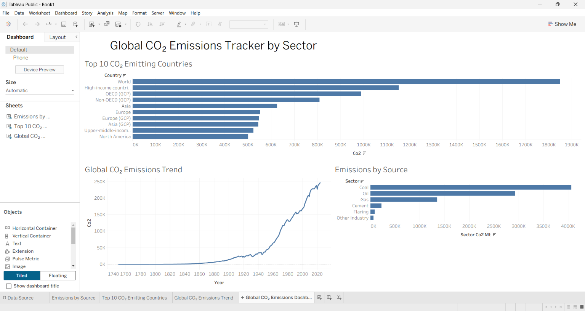

# Global CO₂ Emissions Tracker

## Project Overview

The Global CO₂ Emissions Tracker is a data analysis and visualization project that explores carbon dioxide emissions across countries, years, and major emission sources.

The project combines Python, Excel, Tableau, and a policy brief to analyze global CO₂ emission patterns and present the findings in an easy-to-understand format.

---

## Objectives

- Analyze global CO₂ emissions across countries.
- Identify the top CO₂-emitting countries.
- Analyze CO₂ emission trends over time.
- Compare emissions from major sources such as coal, oil, gas, cement, flaring, and other industrial sources.
- Build an interactive Tableau dashboard.
- Provide policy recommendations based on the analysis.

---

## Project Structure

```text
co2-emissions-tracker/
│
├── data/
│   └── processed/
│       ├── co2_country_year_processed.csv
│       └── co2_sector_processed.csv
│
├── excel/
│   └── CO2_Emissions_Analysis.xlsx
│
├── images/
│   └── CO2_Emissions_Dashboard.png
│
├── report/
│   └── CO2_Policy_Brief.pdf
│
├── tableau/
│   └── CO2_Emissions_Dashboard.twb
│
├── .gitignore
├── data_prep.py
├── README.md
└── requirements.txt
```

---

## Technologies Used

- Python
- Pandas
- Microsoft Excel
- Tableau Public
- Git
- GitHub

---

## Data Preparation

The data preparation process was performed using Python.

The project includes a Python script:

`data_prep.py`

The processed datasets generated for analysis are:

`data/processed/co2_country_year_processed.csv`

`data/processed/co2_sector_processed.csv`

These processed datasets were used for further analysis and visualization.

---

## Analysis

The project analyzes CO₂ emissions from multiple perspectives.

### 1. Country-Level Analysis

The analysis identifies major CO₂-emitting countries and compares their emission levels.

### 2. Global Emissions Trend

The project examines how global CO₂ emissions have changed over time.

### 3. Emissions by Source

The analysis compares emissions from major sources, including:

- Coal
- Oil
- Gas
- Cement
- Flaring
- Other Industrial Sources

---

## Dashboard

The Tableau dashboard includes three main visualizations:

### Top 10 CO₂ Emitting Countries

A comparison of the countries and regions with the highest CO₂ emissions.

### Global CO₂ Emissions Trend

A visualization showing how CO₂ emissions have changed over time.

### Emissions by Source

A comparison of CO₂ emissions from different sources, including coal, oil, gas, cement, flaring, and other industrial sources.

## Dashboard Preview



---

## Key Findings

- CO₂ emissions are concentrated among major emitting countries and regions.
- Global CO₂ emissions have changed significantly over time, with a strong long-term increase visible in the emissions trend.
- Coal is one of the largest contributors to CO₂ emissions among the analyzed emission sources.
- Oil and gas are also significant contributors to total CO₂ emissions.
- Source-level analysis helps identify sectors where emission reduction strategies can have the greatest impact.
- Country-level analysis helps identify major contributors that should be priorities for climate action and emission reduction policies.

---

## Policy Recommendations

1. **Accelerate the transition to clean energy**  
   Increase investment in renewable and low-carbon energy sources.

2. **Reduce dependence on fossil fuels**  
   Prioritize strategies that reduce emissions from major fossil fuel sources such as coal, oil, and gas.

3. **Improve energy efficiency**  
   Encourage industries, businesses, and households to adopt more energy-efficient technologies.

4. **Prioritize high-emission sources**  
   Focus emission reduction strategies on the largest contributing sectors.

5. **Strengthen international cooperation**  
   Encourage collaboration, technology sharing, and common emission reduction targets.

6. **Use data-driven monitoring**  
   Continuously monitor emissions data to measure progress and support evidence-based policy decisions.

---

## Deliverables

- Python data preparation script
- Processed CO₂ emissions datasets
- Excel analysis workbook
- Tableau dashboard
- Dashboard image preview
- PDF policy brief with key findings and recommendations

---

## How to Run the Project

### 1. Clone the Repository

```bash
git clone https://github.com/gnaneswar-reddy-123/Global-CO2-Emissions-Tracker.git
```

### 2. Navigate to the Project Folder

```bash
cd Global-CO2-Emissions-Tracker
```

### 3. Install Required Python Packages

```bash
pip install -r requirements.txt
```

### 4. Run the Data Preparation Script

```bash
python data_prep.py
```

### 5. Open the Tableau Dashboard

Open the following file in Tableau:

`tableau/CO2_Emissions_Dashboard.twb`

---

## Author

**Gnaneswar Reddy**

GitHub: https://github.com/gnaneswar-reddy-123

---

## Conclusion

The Global CO₂ Emissions Tracker demonstrates how data analysis and visualization can be used to understand global emission patterns.

By analyzing emissions across countries, time periods, and emission sources, the project highlights important areas for climate action. The findings emphasize the importance of reducing dependence on fossil fuels, improving energy efficiency, supporting clean energy, and using data-driven monitoring to track progress.